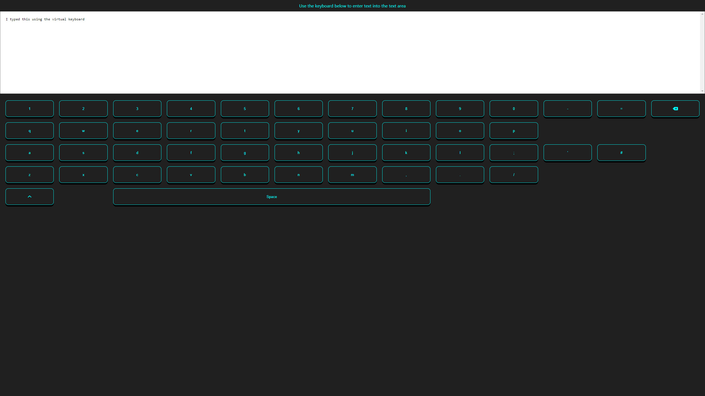
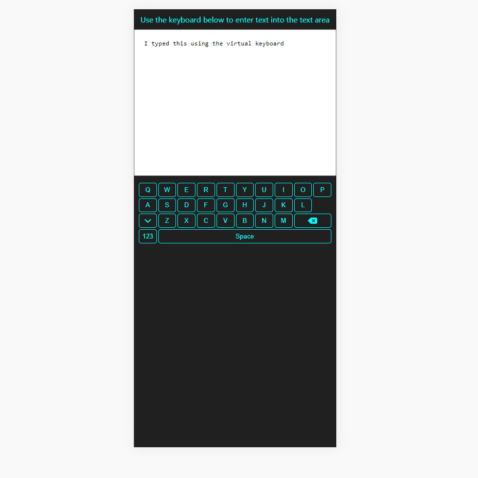

# Taskify - Virtual Keyboard

👋 Hi, I’m @Jason-Smith-Code

👀 I’m interested in

- Programming (Javascript)
- Gaming ( RTS, FPS & ARPG's)

📫 How to reach me
https://www.linkedin.com/in/jason-smith-code/

## Application Description

This is a portfolio project, where I am challenging myself to create a responsive virtual keyboard, and a text area to test input from teh keyboard.
This will be a web application, and be built with React.

## Objective

The keyboard will replicate the key layout of a standard uk board. I will achieve this using CSS-Grid.
Each button on the keyboard will create the corrosponding character when pressed, sending that character to a text on the screen.
The keyboard must also be usable on mobile, for this I will research optimal way to display all keys on a small screen.
Once the project is working as intended, I will refactor my code so that it becomes easier to maintain.

## What was my Workflow

- **✅ Create Project Steps**  
  A great starting point is to plan ahead, break the plan down into steps.

- **✅ Research mobile keyboard layout**  
  This will allow me to get an idea on how it can be display, since I will be using mobile first design.

- **✅ Use github for version control**  
  Set up repository on github, and accessed it locally to start work using git commands to regularly add, commit, and push changes to the repository.

- **✅ Install packages**  
  I had an idea what packages I was going to work with based on the features I wanted to include. Working with React, Jest for testing.

- **✅ Setup file structure**  
  For this project I used create-react-app, I re-organised the file structure and began adding javascript files.

- **✅ Implement keyboard layout**  
  Build the layout of the application.

- **✅ Add text area**  
  This will be interacted with as the user clicks keys on the virtual keyboard.

- **✅ Implement state management**  
  Here I will add functionality to each key, allowing a an on-press event to trigger character input into the text area

- **✅ Check responsive design**  
  I want the application to look great on all mobile, tablet and desktop, I used a mobile first css approach.

- **✅ Create a build and deploy to github pages**  
  To showcase this application, I will use github pages as its free and easy to setup.

## Screen Shots

Desktop

Mobile

## Viewing the application

[View here](https://jason-smith-code.github.io/virtual-keyboard/)
